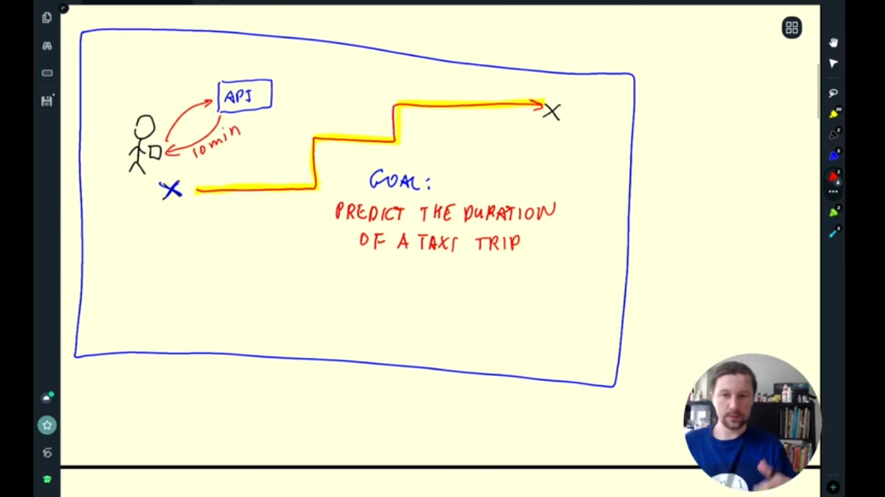

# 📘 Week 1 - Introduction to MLOps

## 📌 1.1 MLOps Introduction

**MLOps** stands for **Machine Learning Operations** — a discipline focused on deploying, managing, and automating ML models in production environments.

### ✅ What is MLOps?

- A combination of **tools, practices, and processes** that help teams reliably and efficiently deploy and maintain machine learning models in production.
- It enables moving from experimentation to deployment **without losing reproducibility, reliability, and scalability**.

### 🚴 Use Case: Duration of Ride Prediction Problem

A common ML problem used to illustrate MLOps is predicting the **duration of a rider’s trip** based on data like pickup/dropoff time and location.

### ⚙️ Key Stages in ML Workflow

The typical lifecycle of a machine learning project can be broken down into three stages:

Design ---> Train ---> Operate

- **Design**: Understanding the business problem, data exploration, feature selection, model architecture design.
- **Train**: Training and evaluating models, tuning hyperparameters, validating performance.
- **Operate**: Deploying models to production, monitoring, retraining, and maintaining them.

🖼️ 

### 🌐 Model Deployment

- ML models are usually deployed as **web services**, often via RESTful **APIs**, allowing other applications to interact with them in real time.

### 🛠️ Role of MLOps

MLOps supports every stage of the ML lifecycle by:

- **Improving collaboration** among team members.
- Ensuring **reproducibility** of experiments.
- Enabling **automated retraining** and **one-click deployments**.
- Facilitating **version control** for both code and data.
- **Monitoring** model performance and enabling CI/CD pipelines.

> 🔁 In short, MLOps brings DevOps-style automation and collaboration to machine learning projects.

---

## 🛠️ 1.2 - Environment Configuration/Setup

Set up the MLOps Zoomcamp development environment using **GitHub Codespaces**, **AWS EC2**, **Anaconda**, **Docker**, and **VS Code Remote SSH**.

📁 Detailed step-by-step setup guide: [env_configuration.md](env_configuration.md)

---

## 🧠 1.3 - Duration of Ride Prediction Problem

This is the first practical assignment of the course. The goal is to build a baseline machine learning model to predict the **duration of taxi rides** in NYC.

🖼️ 

📁 **Notebook**:  
All the development code is available in the `notebooks/` folder.  
- 📘 [Duration Prediction](notebooks/duration_prediction.ipynb)  
- 🏠 [Homework Week 1](notebooks/Homework_week1.ipynb)

📁 **Data**:  
Input datasets are stored in the `data/` folder.  
The original dataset can be downloaded from the official NYC TLC website:  
🔗 [NYC Taxi Trip Record Data](https://www.nyc.gov/site/tlc/about/tlc-trip-record-data.page)

📁 **Model**:  
Trained models are saved in the `models/` folder.  
The first baseline model is trained using Scikit-Learn.

Key components:
- Data reading and preprocessing using **Pandas**
- Feature engineering
- Training a **Linear Regression** model using **Scikit-Learn**
- Saving the trained model with **pickle**
- Evaluating performance using RMSE

---

## 🚦 1.4 - MLOps Maturity Model

Understanding where an organization stands in its MLOps journey is essential for planning scalable and reliable ML systems. This section follows the **MLOps Maturity Model** as defined by Microsoft.

📖 Reference:  
🔗 [Machine Learning Operations (MLOps) Maturity Model – Microsoft Docs](https://learn.microsoft.com/en-us/azure/architecture/ai-ml/guide/mlops-maturity-model)

The model is divided into **four levels** based on how mature and automated the ML lifecycle is within an organization.

🖼️ 

### 🔹 Level 0 - No MLOps

- Manual experimentation and deployment.
- Not reproducible or versioned.
- No collaboration between teams.
- Risk of model drift and lack of monitoring.

🖼️ 

### 🔹 Level 1 - DevOps Practices for ML

- Version control for code and data.
- Manual CI/CD pipelines begin to form.
- Data scientists and engineers start to collaborate.
- Still some manual steps in training and deployment.

🖼️ 

### 🔹 Level 2 - Automated ML Pipeline

- Automated training, validation, and deployment.
- CI/CD pipelines trigger on data/code changes.
- Model registry introduced for versioning.
- Monitoring and feedback loops begin to form.

🖼️ 

### 🔹 Level 3 - CI/CD and CT for ML

- Full automation of ML lifecycle (CI/CD/CT).
- Continuous Training (CT) pipelines triggered by data drift.
- Governance, auditing, and explainability built in.
- Real-time monitoring and alerts.

🖼️ 

---

